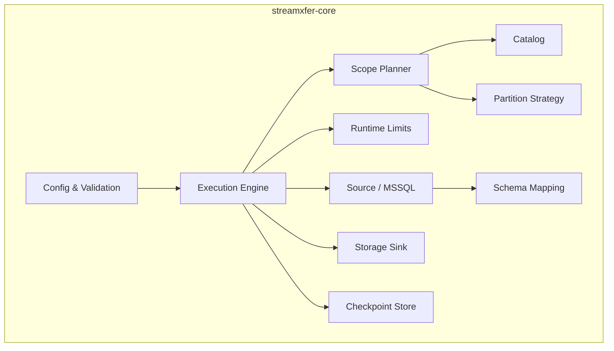

# Architecture Overview

StreamXfer is structured as a Rust workspace with three crates:

```
StreamXfer/
├── crates/
│   ├── streamxfer-core/   # Core engine (library)
│   ├── streamxfer-cli/    # CLI binary
│   └── streamxfer-py/     # Python bindings
```

## Core Architecture



## Module Responsibilities

### `config`

Defines the `ExportConfig` struct and all related enums (`OutputFormat`, `CompressionCodec`, `ConsistencyMode`, `ExportScope`). Handles validation, table reference parsing, and path sanitization.

### `planner`

Responsible for transforming an `ExportConfig` into a list of `ExportTask` objects:

- **`scope.rs`** — `ScopePlanner` expands table/query/schema/database scopes into individual tasks
- **`catalog.rs`** — `Catalog` trait for listing tables; `StaticCatalog` for testing, live catalog queries `INFORMATION_SCHEMA`
- **`partition.rs`** — `PartitionStrategy` splits large tables into range or predicate-based partitions

### `runtime`

- **`engine.rs`** — `ExecutionEngine` orchestrates planning and execution
- **`limits.rs`** — `RuntimeLimits` validates concurrency settings

### `source`

- **`mssql.rs`** — SQL Server connection management via tiberius, query generation, column metadata retrieval

### `schema`

- **`mapping.rs`** — Maps SQL Server column types to Arrow types (`ArrowType` enum)

### `sink`

- **`storage.rs`** — `StorageSink` trait with `LocalSink` implementation; URI parsing for local/S3/GCS/Azure targets

### `checkpoint`

- `CheckpointStore` trait with `InMemoryCheckpointStore` and optional `RocksDbCheckpointStore`
- Tracks per-file export state (Planned → Running → Uploaded → Committed)

## Design Principles

1. **No External Dependencies** — Connects directly to SQL Server via TDS protocol (tiberius). No BCP, ODBC drivers, or shell utilities required.

2. **Streaming Architecture** — Data flows from source through Arrow record batches to storage sinks without buffering entire tables in memory.

3. **Hierarchical Concurrency** — Three levels of parallelism (table, partition, global I/O) with configurable limits and memory budgets.

4. **Atomic Writes** — All storage writes are atomic (temp file + rename for local, multipart upload for cloud) to prevent partial/corrupt files.

5. **Resumable** — Fine-grained checkpointing at the file level allows interrupted exports to resume efficiently.

6. **Separation of Concerns** — Planning is independent from execution. The planner produces a task list; the runtime executes it. This enables dry-run, testing, and different execution strategies.
